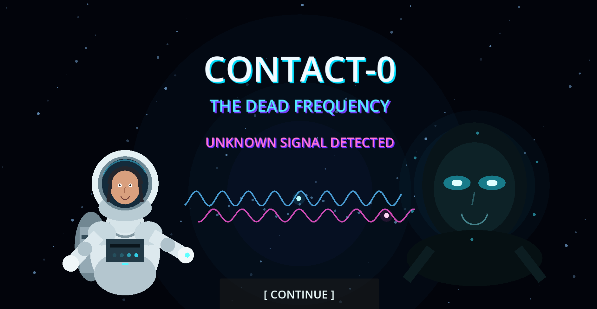
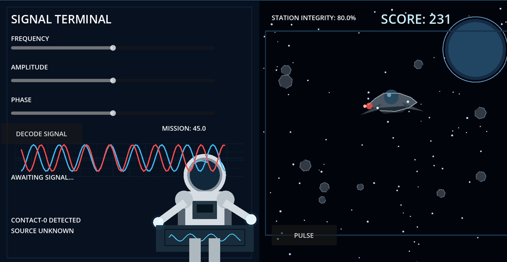

#🛸 CONTACT-0: THE DEAD FREQUENCY

A sci-fi mystery survival game where you decode an unknown deep-space signal, align its frequency, amplitude, and phase, and defend your station against mysterious incoming threats.

## Gameplay

* Decode the mysterious CONTACT-0 signal.
* Adjust frequency, amplitude, and phase.
* Monitor the incoming signal.
* Defend the station against unknown spacecraft.
* Use the PULSE system to destroy threats.
* Survive and uncover the mystery behind the signal.

## Screenshots

### Start Menu

### Gameplay

## Platform

Windows 64-bit

## Engine

Godot Engine

## Developer

Rimita Ghosh
